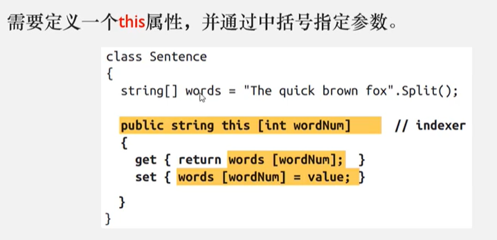
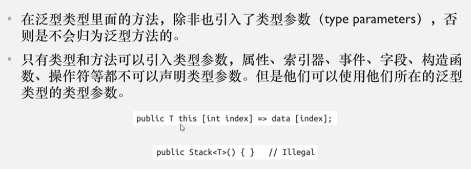
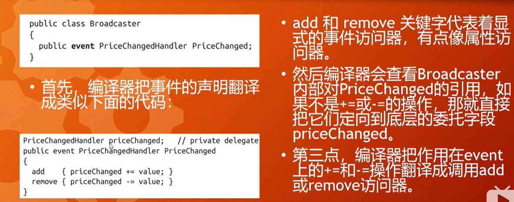

# 真会C#吗？

## 第1-2章 基础


### 预定义的数值类型


### 数值的后缀

数值的后缀会显式的定义Literal的类型


### 默认值

- 所有类型的实例都有默认值
- 预定义类型的默认值就是内存按位归零的结果


### 参数

- 形参：parameters
- 实参：arguments

#### 不限数量的参数

在参数名前面加`params`就好了：

```c#
private void test(params int[] args){
    print(args.Length);
}
```

#### 方法参数传递的方式


其他的都好理解，提一下按值传递引用类型的arguments，默认也是会复制，不过复制的是引用（指针），而不是对象。

关于`ref`与`out`，看完下面的代码就明白了

```c#
private void test(ref int a, out int b, out int c) {
    a = 0;
    b = 1;
    c = 2;
}

int a = 10;
test(a, out int x, out int y);
print(a); // 0
print(x); // 1
print(y); // 2
```

## Null操作符

### Null合并操作符

```c#
int? a = null;	// int? 是可空类型
int b = a ?? 0; // 0

string a = null;
string b = a ?? "nothing"; // nothing
```

### Null条件操作符

`obj?.DoSomething()`，如果`?.`左边的对象为空的话，就直接返回`null`，后面的表达式就短路了。

```c#
string a = null;
int b = a?.Length; // null
```

## 第3章 创建类型

### 字段和方法

#### readonly 修饰符

和Java或者dart里的final修饰符差不多，就是赋值一次后就不能再重新赋值了。

#### 本地方法

C# 7.0 新增的一种，就是一个方法中还能再定义一个方法：

对了，不能用static修饰。本地方法里面也能继续写本地方法（禁止套娃）。本地方法也可以是异步的。

```c#
void test() {
    print(Cube(2));
    print(Cube(3));
    
    int Cube(int value) => value * value * value;
}
```

### 构造函数

- 返回值是其class或者struct的类型
- 可以重载

以下代码中，实例化Test类的时候，会先执行`Test(1)`，再执行`Test()`。

```c#
class Test {
    Test() : Test(1) => print("init");
    Test(int a) => print(a);
}
```

- 不建议在构造函数里面用可选参数，这样如果以后修改了，会导致其他依赖的Assembly调用构造函数时发生错误。

### 析构函数 Deconstruct

C# 7 才有的，可以把类里面的字段传出去，要求至少有一个out参数。同样支持重载，还能是扩展方法。

定义如下：

```c#
class Test {
    public readonly int a, b;
    public Test(int a, int b) {
        this.a = a;
        this.b = b;
    }
    
    public void Deconstruct(out int a, out int b) {
        a = this.a;
        b = this.b;
    }
}
```

使用方法如下：

```c#
void Main() {
    var test = new Test(1, 2);
    (var a, var b) = test;	// Deconstruct
    // 简写
    var (a, b) = test;
    // 也可以这么用
    test.Deconstruct(out int a, out int b);
}
```

作为扩展方法：

```c#
public static class Extension
{
    public static void Deconstruct(this Test2 test, out int a, out int b)
    {
        a = test.a;
        b = test.b;
    }
}
```

### 属性

- 可以只读也可以只写（很少用）
- C# 6开始就可以在get访问器用expression body
- C# 7开始set也可以用expression body了
- C# 6开始可以给自动属性添加初始化器，只读的自动属性也可以用（只读属性本身在构造函数里面可以赋值）

```c#
public int Price { get; set; } = 123;
public int One { get; } = 123;
```

- get和set访问器还能设置不同的访问级别：


### 索引器

很好用的特性，python也有，但垃圾Java就没有了



- 一个类型可以声明多个索引器（支持重载）
- 一个索引器可以有多个参数
- C# 6 以后可以使用expression body写法

### 常量

- 编译的时候自动替换成常量里面的值，有点像C语言的宏
- 当值有可能改变，并且需要暴露给其他Assembly使用的时候，最好使用静态只读字段。

### 静态构造函数

- 一个类型只会执行一次
- 在类型使用之前的一瞬间自动调用
- 静态字段的初始化器在静态构造函数前执行
- 如果没有静态构造函数，静态字段在类型被使用之前执行（或者更早，在运行时突发奇想执行）
- 静态字段的初始化顺序和声明顺序一致

### nameof 操作符

- C# 6 才有的
- nameof 操作符会返回任何符号的名字 （string）
- 利于重构

```c#
int count = 1;
string name = nameof(count); // count
name = nameof(StringBuilder.Length); // Length
```

### 继承

- 向上转换：子类->父类，隐式
- 向下转换：父类->之类，显式

显示转换

```c#
Parent a = new Parent();
Children b = (Children)a;  // 失败会抛出异常
Children c = a as Children;  // 失败就返回null
```

#### is 操作符

判断对象是否派生自某个类，或者实现了某个接口。


### virtual 成员

标记为virtual的成员（方法、属性、索引器、事件），可以被之类重写

### 抽象类和抽象成员

abstract

- 抽象类：所有成员都是抽象成员
- 抽象成员：在抽象类内，和virtual方法差不多，但是没有实现
- 可以继承

### 隐藏被继承的成员

```c#
class A { public int Counter = 1; }
class B : A { public int Counter = 1; }
```


### Object 类型

- 装箱：值类型->引用类型
- 拆箱：反过来
- 数组和泛型只支持引用转换，不支持装箱

### Struct

- 是值类型，class是引用类型
- 不支持继承，除了隐式继承object（System.ValueType)
- 不可以有以下成员
  - 无参构造函数
  - 字段初始化器
  - 终结器 Finalize
  - virtual 或 protected 成员
- 有一个无参构造函数，会对字段进行按位置零，但是不能自己重写
- 定义struct构造函数的时候，必须显式为每个字段赋值
- 不可以有字段初始化器

### 访问修饰符


### 枚举

- 枚举是一个特殊的值类型

#### 底层原理


#### 枚举的转换

可以显式和底层的数值相互转换

```c#
int i = (int) BorderSide.Left;
BorderSide side = (BorderSide) i;
```

#### 特殊值：0

- 在枚举表达式中，0数值会被编译器特殊对待，它不需要显式转换
- 枚举的第一个成员通常被当作“默认值”，其默认值就是0
- 组合枚举里，0没有标志(flags)

#### 组合枚举 Flags Enum

- 可以对枚举的成员进行组合
- 为了避免歧义，枚举成员需要显式的赋值，典型的就是使用2的乘幂

```c#
[Flags]
public enum BorderSides { None=0, Left=1, Right=2, Top=4, Bottom=8 }
```

##### 使用


##### 底层原理


##### Flags 属性

- 按约定，如果枚举可以组合，就要在枚举上面添加flags属性，不添加也可以用组合，但是`ToString()`的时候就会输出一个数，而不是一组名称
- 按约定，可组合枚举的名称应该是复数形式
- 声明可组合枚举的时候，可以直接使用组合的枚举成员作为成员

```c#
[Flags]
public enum BorderSides {
    None=0,
    Left=1, Right=2, Top=4, Bottom=8,
    LeftRight = Left | Right,
    TopBottom = Top | Bottom,
    All = LeftRight | TopBottom
}
```

#### 枚举支持的操作符


#### 类型安全

- 根据B站的弹幕说是支持Flags Enum的


### 嵌套类型

- 一个类型里面再声明一个类型
- 
- 特性
- 

### 泛型

基本概念我就不记了，很简单

#### 泛型方法

定义

```c#
static void Swap<T> (ref T a, ref T b) {
    T temp = a;
    a = b;
    b = temp;
}
```

使用

```c#
int x = 5;
int y = 6;
Swap(ref x, ref y); // 自动推断
Swap<int>(ref x, ref y);
```



#### 声明类型参数


#### 声明泛型类型


#### typeof 与 未绑定的泛型类型


#### 泛型的默认值

使用default关键字获取泛型参数的默认值（之前学到的default关键字终于用上了）

#### 泛型的约束


普通例子：

```c#
class SomeClass { }
interface Interface1 { }

class GenericClass<T, U>
where T : SomeClass, Interface1
where U : new()
{ }
```

Naked Type例子 （裸类型约束）


#### 泛型类型的子类


#### 类型参数和转换

得用第二种，用as转换。


#### 协变、逆变、不变

- Covariance 协变：当值作为返回值/out输出
  - 子类T可以向父类T转换
- Contravariance 逆变：当值作为输入 input
  - 父类T可以转换为子类T
- Invariance 不变：当值既是输入也是输出

看看下面的定义的例子：


来自B站弹幕：逆变是类型更具体的变化，协变是类型更广泛的变化。

#### 最后

- 搞清楚这些概念的意义：搞明白了才能愉快的玩Linq
- C#的泛型，生产类型（例如`List<T>`可以被编译到dll里，这是因为这种在生产者和产制封闭类型的消费者之间的合成是发生在运行时的）

### 委托

- 委托是一个对象，它知道如何调用一个方法

#### 委托类型

定义了委托实例可以调用的那类方法，具体点，它定义了方法的返回类型和参数。

（有点像函数指针）

```c#
delegate int Transformer(int x);
```

#### 委托实例

- 把方法赋值给委托变量的时候就创建了委托实例
- 委托实例其实就是调用者的委托：调用者调用委托，然后委托调用目标方法
- 间接的把调用者和目标方法解耦合了

```c#
delegate int Transformer(int x);
static void Main(string[] args)
{
    // 创建委托实例
    Transformer t = Square;
    // 完整写法
    Transformer t1 = new Transformer(Square);

    // 调用委托
    t(3);
    // 完整写法
    t.Invoke(3);
}
static int Square(int x) => x * x;
```

#### 多播委托

- 一个委托实例可以引用一组目标方法。
- 使用+和+=合并委托实例，对应`System.Delegate.Combine()`静态方法
- 使用-和-=移除，对应``System.Delegate.Remove()`静态方法
- 调用顺序和它们的添加的顺序一致
- 调用的时候接受最后一个方法的返回值

```c#
delegate int Transformer(int x);
static void Main(string[] args)
{
    Transformer t = Square;
    t += Increase;
    t -= Square;
}
static int Square(int x) => x * x;
static int Increase(int x) => ++x;
```

注意：

- 委托是不可变的
- 使用+=或-=是创建了新的委托实例，然后重新赋值给委托变量

#### 委托的Target

可以把实例方法或者静态方法赋值给委托。

- 如果是实例方法，那`System.Delegate.Target`这个属性就存着这个实例
- 如果是静态方法，那这个Target就是null

#### 泛型委托

```c#
delegate T Transformer<T>(T args);
```

内置的比如`Func<T, T>`，`Action<T>`这些。

### 事件

订阅者模式：

- 使用委托的时候，通常会出现两个角色，一个广播者，一个订阅者。（广播就是委托，订阅者就是方法。）
- 广播者这个类型包含一个委托字段，广播者通过调用委托来决定什么时候进行广播
- 订阅者是方法目标的接收者，订阅者可以决定什么时候开始或结束监听。方法通过在委托上+=或-=。
- 一个订阅者不知道也不干扰其他订阅者

定义事件，在委托前面加个event关键字就行了：

```c#
public delegate void PriceChangedHandler(decimal oldPrice, decimal newPrice);

public class Broadcaster
{
    public event PriceChangedHandler PriceChanged;
}
```

#### 事件在内部如何工作？



#### 为事件选择或定义委托

- 返回类型得是void
- 接收两个参数，第一个类型object（表示广播者），第二个是EventArgs的子类（包含传递的信息）
- 名称必须以EventHandler结尾

#### 可触发事件的protected virtual方法

方法名就是On+事件名，接收一个EventArgs参数

```c#
public class PriceChangedEventArgs : EventArgs
{
    public decimal OldPrice { get; set; }
    public decimal NewPrice { get; set; }
}

public class Stock
{
    public event EventHandler<PriceChangedEventArgs> PriceChanged;

    protected virtual void OnPriceChanged(PriceChangedEventArgs e)
    {
        if (PriceChanged != null) PriceChanged(this, e);
    }
}
```

