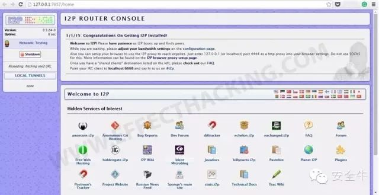

## 深网
深网是互联网上无法通过普通方法访问到的内容，这些普通的方法包括使用谷歌、百度等搜索引擎。深网的内容主要是一些需要某些条件如注册、付费，才能访问的内容，如数据库和某些服务。

下面是访问深网的工具：

### FreeLunch（免费午餐）

使用这个工具可以访问到经济学、人口学和金融方面的数据，普通搜索引擎的爬虫无法爬到的内容。

### Shodan

这个搜索引擎在安全圈已经任人皆知了，有人叫它“撒丹”，也有人戏称之为“傻蛋”。不管叫什么，它搜索的内容是物联网社备。如包括摄像头、路由器等智能家居，还有一些工控系统等。国内类似的一个搜索引擎就是ZoomEye，但后者全面些，还可搜索网站组件。

## 暗网
暗网简单的解释就是加密网络，它必需使用匿名代理工具才能访问。

有人认为暗网是一个丑陋凶险的地方，的确，暗网里有儿童色情和非法物品的售卖，比如武器和毒品。但这些人不知道的是，实际上这些邪恶的东西，只占暗网的很小一部分，大部分内容则是有价值的资料和信息。

2014年，一个慈善机构——互联网观察基金，与执法部门和互联网服务提供商合作清除儿童色情网站。他们共发现了3.1万个包含儿童色情图片的网址，但只有51个，即0.2%属于暗网。

还有人以为暗网是政府和执法机构很难触及的法外之地，对于这种认识，一个字足以回答：错。

**下面介绍如何安装和使用访问暗网的工具TOR：**
1. 下载Tor浏览器 

链接：https://www.torproject.org/projects/torbrowser.html

2. 安装后启动程序

3. 点击“Connect”（连接），出现下面的窗口：

等待一会儿，Tor浏览器的窗口出现后，就能够开始暗网之旅了！

## 探索暗网
如何搜索暗网呢？下面是一些**基于Tor网络的搜索引擎：**

### Ahmia.fi
这是一个基础的Tor隐藏服务搜索引擎，内容不是很庞大，但做为暗网之旅的开始还是不错的选择。

普通URL: https://ahmia.fi

暗网URL： msydqjihosw2fsu3.onion

### Torch（火炬）
这是最好的Tor网络搜索引擎，有着巨大的数据库，约110万个页面。

暗网URL：http://xmh5752oemp2sztk.onion

### Grams
这个引擎是专门设计用来搜索暗网的，堪称暗网中的谷歌。

暗网URL： http://grams72tru2gdpl2.onion

### Not Evil（不做恶）
这是个简易搜索引擎，但，没有广告。

暗网URL：http://hss3uro2hsxfogfq.onion

### Sinbad Search（辛巴达搜索）
另一个拥有大型数据库的Tor搜索引擎。

暗网URL：http://sinbad66644fr5lq.onion

## 另一个暗网
上面介绍了Tor网络的访问，下面我们介绍一下另一张暗网，I2P。

1. **下载I2P**

https://geti2p.net/en/download

2. **安装后并启动程序，即可看到I2P的路由控制台( Router Console )：**

然后你必须把浏览器设置成使用I2P，以Firefox为例：

打开浏览器–>菜单–>选项–>高级–>网络–>设置

在连接设置窗口选择，“手动代理配置”：

    HTTP Proxy 栏中填入127.0.0.1，端口填4444；
    SSL Proxy 栏中填入127.0.0.1，端口填4445；
    No Proxy for 框中填入“localhost 127.0.0.1”。

FTP代理设置相同。

3. **确定**

4. **转到控制台（Router console）点击你想访问的隐藏服务，如果发生错误就点击另一个。**

这里是一些使用I2P网络的搜索引擎：

### Direct（导向）
这是一个简易界面的搜索引擎，但它主面上显示的活动主机列表很有帮助。

URL:http://direct.i2p

### BTDigg
这是一个搜索免费BT种子的搜索引擎，可以找到各种内容的torrent链接。

URL: http://btdigg.i2p